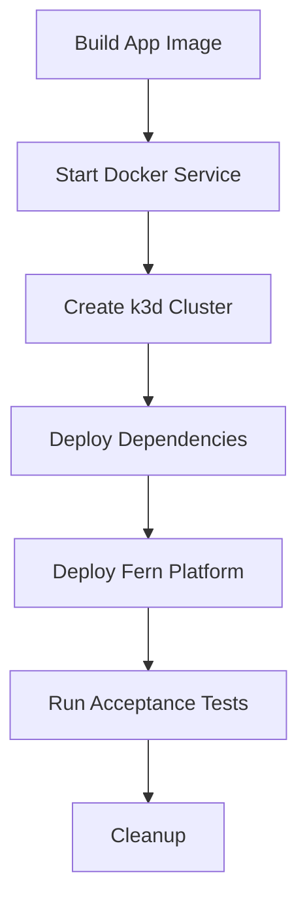

# Fern Platform CI/CD with Dagger

This directory contains the Dagger CI/CD module for Fern Platform, providing a complete pipeline for building, testing, and deploying the application.

## Overview

The CI/CD pipeline is built using [Dagger](https://dagger.io/), a programmable CI/CD engine that runs pipelines in containers. This approach provides:

- **Portability**: Run the same pipeline locally and in CI
- **Reproducibility**: Consistent environments across all executions
- **Type Safety**: Go-based configuration with compile-time checks
- **Caching**: Intelligent caching for faster builds

## Prerequisites

- Dagger v0.16.3 or later
- Docker
- Go 1.21+ (for local development)

## Local Usage

### Install Dagger

```bash
# macOS
brew install dagger/tap/dagger

# Linux
curl -L https://dl.dagger.io/dagger/install.sh | BIN_DIR=$HOME/.local/bin sh

# Or download from https://github.com/dagger/dagger/releases
```

### Run CI Tasks Locally

```bash
# Run all checks
dagger call -m ./ci all --source .

# Run specific tasks
dagger call -m ./ci lint --source .
dagger call -m ./ci test --source .
dagger call -m ./ci security-scan --source .
dagger call -m ./ci build --source . --platforms "linux/amd64,linux/arm64"

# Run acceptance tests
dagger call -m ./ci acceptance-test --source .

# Publish images (requires auth)
dagger call -m ./ci publish \
  --source . \
  --registry "docker.io/myorg/fern-platform" \
  --tag "v1.0.0" \
  --username env:DOCKER_USERNAME \
  --password env:DOCKER_PASSWORD
```

## CI/CD Pipeline

### GitHub Actions Workflows

1. **CI Workflow** (`.github/workflows/ci.yml`)
   - Runs on every push and pull request
   - Executes: lint, test, security scan, build
   - Runs acceptance tests on PRs

2. **Release Workflow** (`.github/workflows/release.yml`)
   - Triggered by version tags (v*)
   - Builds and publishes multi-platform images
   - Creates GitHub releases

3. **CodeQL Workflow** (`.github/workflows/codeql.yml`)
   - Security scanning for Go and JavaScript
   - Runs on schedule and PRs

4. **PR Validation** (`.github/workflows/pr-validation.yml`)
   - Validates PR titles follow conventional commits
   - Runs acceptance tests
   - Comments on PR if tests fail

## Module Functions

### Build
Builds the Go application for specified platforms.

```go
func Build(source *Directory, platforms string) *Container
```

### Test
Runs unit tests with race detection and coverage.

```go
func Test(source *Directory) (string, error)
```

### Lint
Runs golangci-lint for code quality checks.

```go
func Lint(source *Directory) (string, error)
```

### SecurityScan
Performs vulnerability scanning with Trivy.

```go
func SecurityScan(source *Directory) (string, error)
```

### AcceptanceTest
Runs acceptance tests with k3d cluster.

```go
func AcceptanceTest(source *Directory, image string) (string, error)
```

### Publish
Builds and publishes multi-platform images.

```go
func Publish(source *Directory, registry string, tag string, platforms string, username *Secret, password *Secret) (string, error)
```

## Acceptance Testing Architecture

The acceptance test module creates a complete Kubernetes environment using k3d:

1. **Docker-in-Docker**: Uses DinD for container operations
2. **k3d Cluster**: Creates a lightweight Kubernetes cluster
3. **Dependencies**: Deploys PostgreSQL and Redis
4. **Application**: Deploys Fern Platform with test configuration
5. **Test Execution**: Runs Go-based acceptance tests

### Test Flow



## Configuration

### Environment Variables

- `DOCKER_USERNAME`: Registry username for publishing
- `DOCKER_PASSWORD`: Registry password for publishing
- `DEBUG_OAUTH`: Enable OAuth debugging in tests

### Secrets (GitHub Actions)

Configure these secrets in your repository:

- `DOCKER_REGISTRY`: Target registry (e.g., `docker.io/myorg/fern-platform`)
- `DOCKER_USERNAME`: Registry username
- `DOCKER_PASSWORD`: Registry password

## Extending the Pipeline

To add new CI tasks:

1. Add a new function to `ci/main.go`
2. Follow the Dagger function signature patterns
3. Update workflows to call the new function
4. Test locally with `dagger call`

Example:

```go
// CustomCheck runs a custom validation
func (m *Ci) CustomCheck(
    ctx context.Context,
    source *Directory,
) (string, error) {
    return dag.Container().
        From("alpine:latest").
        WithMountedDirectory("/src", source).
        WithExec([]string{"your", "custom", "command"}).
        Stdout(ctx)
}
```

## Troubleshooting

### Local Development

```bash
# Check Dagger version
dagger version

# Run with debug output
DAGGER_LOG_LEVEL=debug dagger call -m ./ci test --source .

# Clear Dagger cache
dagger query <<EOF
{
  host {
    pruneCache
  }
}
EOF
```

### Common Issues

1. **k3d tests failing**: Ensure Docker has enough resources (4GB+ RAM)
2. **Platform build errors**: Check Docker buildx is properly configured
3. **Registry auth failures**: Verify credentials are properly set

## Benefits of Dagger Approach

1. **No YAML**: Write CI/CD in Go with full type safety
2. **Local Testing**: Run exact CI pipeline locally
3. **Caching**: Intelligent caching speeds up builds
4. **Modularity**: Compose complex pipelines from simple functions
5. **Debugging**: Easy to debug with standard Go tooling