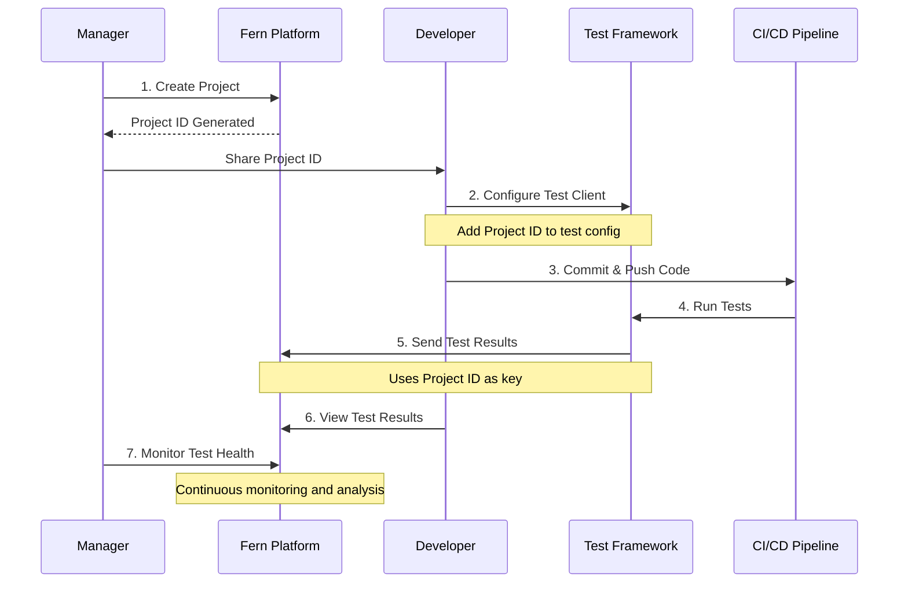
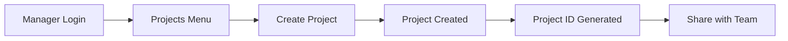
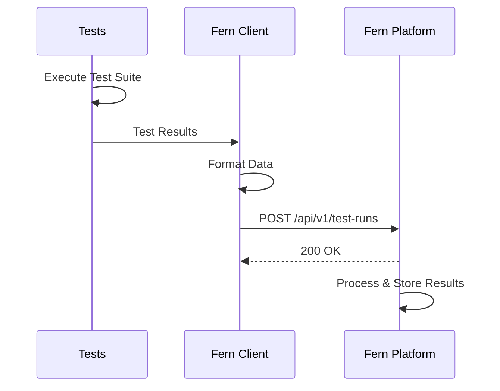

# Fern Platform User Workflows

<div align="center">
  
  
  **Your complete guide to using Fern Platform effectively**
</div>

## 🎯 Overview

This guide walks you through the complete workflow of using Fern Platform, from project creation to test monitoring and analysis. Whether you're a manager setting up projects, a developer integrating tests, or monitoring test health, this guide has you covered.

## 📚 Quick Navigation

| Your Role | Start Here |
|-----------|------------|
| **Engineering Manager** | [Manager Workflow](#-manager-workflow) - Create projects, monitor team health |
| **Developer** | [Developer Workflow](#-developer-workflow) - Integrate tests, view results |
| **QA Engineer** | [QA Workflow](#-qa-engineer-workflow) - Analyze test patterns, track quality |
| **Administrator** | [Admin Tasks](admin-workflow.md) - User management, system configuration |

---

## 🔄 The Fern Platform Workflow



---

## 👔 Manager Workflow

### Step 1: Create a Project

Projects are the top-level entities in Fern Platform that organize and store test results. Each project typically represents a repository or service.

1. **Login** with manager permissions
2. Navigate to **Projects** menu
3. Click **Create Project**
4. Fill in project details:
   - **Name**: Your repository/service name
   - **Description**: Brief description of what this project tests
   - **Team**: Automatically assigned based on your group membership



**💡 Benefits:**
- **Centralized Organization**: All test results for a repository in one place
- **Team Alignment**: Projects automatically inherit team permissions
- **Easy Tracking**: Unique project IDs ensure data isolation

### Step 2: Share Project ID with Your Team

Once created, the project displays its unique ID. This ID is the key that developers need to send test data.

**Where to find the Project ID:**
- Projects list page (visible in the table)
- Project details page (top of the page)
- Can be copied with one click

### Step 3: Monitor Test Health

Managers have access to powerful visualization tools:

#### **Manager Dashboard** (Manager-only feature)
- Create custom treemap visualizations
- Select multiple projects to monitor
- Perfect for displaying on team TVs/monitors
- Shows real-time test health across all selected projects

#### **Test Summaries Page**
- Overview of all team projects
- Current test status at a glance
- Click "View History" to see trends over time

#### **Grid View/Treemap**
- Visual representation of test health
- Size represents time taken (consistent metric across all levels)
- Color indicates pass/fail status
- Drill down: Project → Test Runs → Test Suites → Test Specs

**💡 Benefits:**
- **Real-time Visibility**: See test health as it happens
- **Data-Driven Decisions**: Make informed release decisions based on test trends
- **Team Accountability**: Transparent view of quality across projects

---

## 💻 Developer Workflow

### Step 1: Get Your Project ID

Obtain the project ID from your manager or find it in the platform:
1. Login to Fern Platform
2. Navigate to **Projects**
3. Find your project and copy the ID

### Step 2: Configure Your Test Framework

Choose your test framework and install the appropriate Fern client:

#### **For Ginkgo (Go)**
```bash
go get github.com/guidewire-oss/fern-ginkgo-client
```

```go
import "github.com/guidewire-oss/fern-ginkgo-client/pkg/client"

var _ = ginkgo.ReportAfterSuite("", func(report types.Report) {
    client.Report(
        "YOUR-PROJECT-ID",  // Replace with your project ID
        report,
        client.WithBaseURL("https://your-fern-platform.com"),
    )
})
```
[📖 Full Ginkgo Client Documentation](https://github.com/guidewire-oss/fern-ginkgo-client)

#### **For JUnit (Java)**
```xml
<dependency>
    <groupId>com.guidewire.oss</groupId>
    <artifactId>fern-junit-client</artifactId>
    <version>latest</version>
</dependency>
```

Configure in your test runner:
```java
@RunWith(FernJUnitRunner.class)
@FernConfig(projectId = "YOUR-PROJECT-ID", baseUrl = "https://your-fern-platform.com")
public class YourTestClass {
    // Your tests
}
```
[📖 Full JUnit Client Documentation](https://github.com/guidewire-oss/fern-junit-client)

#### **For JUnit with Gradle**
```gradle
plugins {
    id 'com.guidewire.oss.fern-junit-gradle' version 'latest'
}

fern {
    projectId = 'YOUR-PROJECT-ID'
    baseUrl = 'https://your-fern-platform.com'
}
```
[📖 Full Gradle Plugin Documentation](https://github.com/guidewire-oss/fern-junit-gradle-plugin)

#### **For Jest (JavaScript/TypeScript)**
```bash
npm install @guidewire-oss/fern-jest-client
```

```javascript
// jest.config.js
module.exports = {
  reporters: [
    'default',
    ['@guidewire-oss/fern-jest-client', {
      projectId: 'YOUR-PROJECT-ID',
      baseUrl: 'https://your-fern-platform.com'
    }]
  ]
};
```
[📖 Full Jest Client Documentation](https://github.com/guidewire-oss/fern-jest-client)

#### **For Other Frameworks**
Use the REST API directly:
```bash
curl -X POST https://your-fern-platform.com/api/v1/test-runs \
  -H "Content-Type: application/json" \
  -d '{
    "projectId": "YOUR-PROJECT-ID",
    "status": "passed",
    "duration": 1234,
    "gitCommit": "abc123",
    "gitBranch": "main"
  }'
```

### Step 3: Run Tests and Send Data

Once configured, your test framework will automatically send results to Fern Platform:



### Step 4: View Your Results

Navigate through the platform to see your test data:

1. **Test Summaries** - High-level project health
2. **Test Runs** - All test executions for your projects
3. **Drill Down** - Click any test run to see:
   - Test Suites
   - Individual Test Specs
   - Pass/Fail/Skip status
   - Execution time
   - Error messages for failures

---

## 🔍 QA Engineer Workflow

### Analyzing Test Patterns

1. **Test Runs Page**
   - Filter by project, date range, status
   - Sort by duration to find slow tests
   - Identify patterns in failures

2. **Test History View**
   - Access from Test Summaries → View History
   - See trends over time
   - Identify when issues started

3. **Detailed Drill-Down**
   - Test Run → Suite → Spec
   - View failure messages
   - Compare with previous runs

### Using the Treemap Visualization

The treemap provides instant visual feedback:
- **Size** = Time taken (larger = slower)
- **Color** = Status (green = pass, red = fail, yellow = skip)
- **Hierarchy** = Project → Run → Suite → Spec

**💡 Pro Tips:**
- Slow tests (large boxes) might need optimization
- Frequently failing tests (consistently red) might be flaky
- Use filters to focus on specific time periods or statuses

---

## ⚙️ Platform Features

### Settings Page

Access user-specific settings:
- **Profile Information** - View your email and groups
- **Permissions** - See what actions you can perform
- **API Tokens** - Generate tokens for CI/CD integration (if enabled)

### Navigation Tips

- **Breadcrumbs** - Always show your current location
- **Quick Actions** - Right-click on items for context menus
- **Keyboard Shortcuts** - Press `?` to see available shortcuts
- **Search** - Use the search bar to quickly find projects or test runs

---

## 📊 Understanding Test Metrics

### Time as a Universal Metric

Fern Platform uses execution time as the primary metric because:
- **Consistency** - Available at all levels (project, suite, spec)
- **Performance Indicator** - Slow tests impact CI/CD pipelines
- **Resource Usage** - Time correlates with compute resources

### Test Status Types

- **Passed** ✅ - Test executed successfully
- **Failed** ❌ - Test assertion failed
- **Skipped** ⏭️ - Test was not executed
- **Pending** ⏸️ - Test is defined but not implemented

---

## 🚀 Best Practices

### For Managers
1. **Regular Reviews** - Check test health daily/weekly
2. **Team Meetings** - Use dashboard during standups
3. **Trend Analysis** - Look for patterns over time
4. **Cross-Team Comparison** - Learn from successful teams

### For Developers
1. **Immediate Integration** - Add Fern client when creating new projects
2. **CI/CD Integration** - Always send test results from pipelines
3. **Local Testing** - Configure client to send results during development
4. **Fix Failures Fast** - Use drill-down to quickly identify issues

### For QA Engineers
1. **Daily Monitoring** - Check for new failures each morning
2. **Pattern Recognition** - Look for flaky tests or environment issues
3. **Performance Tracking** - Monitor test execution times
4. **Collaboration** - Share findings with developers promptly

---

## 🆘 Troubleshooting

### Common Issues

**"Project not found" error**
- Verify the project ID is correct
- Ensure you have permissions to access the project
- Check if the project exists in the Projects page

**Test results not appearing**
- Verify the Fern client is configured correctly
- Check network connectivity to Fern Platform
- Look for errors in test framework logs
- Ensure the project ID matches exactly

**Cannot create projects**
- Only managers and admins can create projects
- Check your group membership in Settings
- Contact your admin if you need manager permissions

---

## 📚 Next Steps

- **[API Reference](../developers/api-reference.md)** - Detailed API documentation
- **[Architecture Overview](../ARCHITECTURE.md)** - Understand how Fern Platform works
- **[Contributing Guide](../../CONTRIBUTING.md)** - Help improve Fern Platform

---

*Need help? Check our [GitHub Discussions](../../../../discussions) or [report an issue](../../../../issues).*